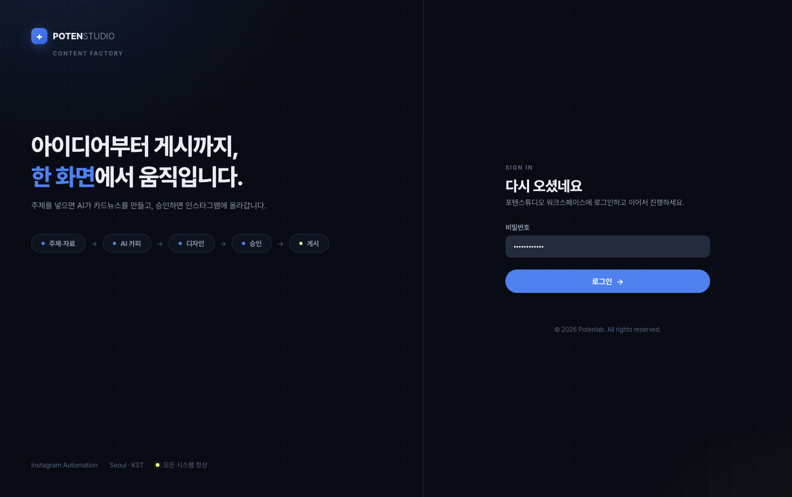
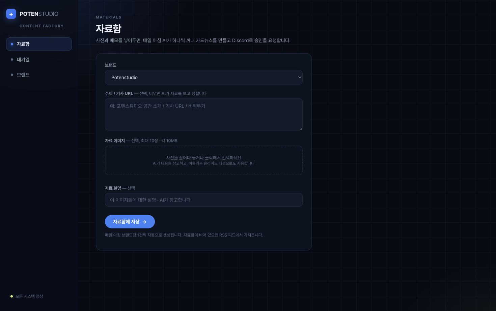
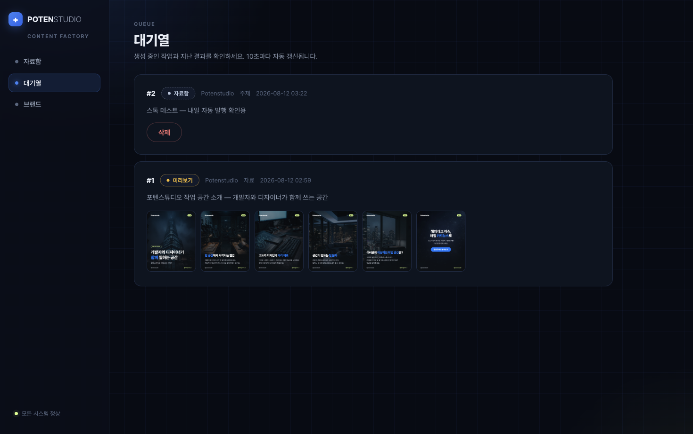
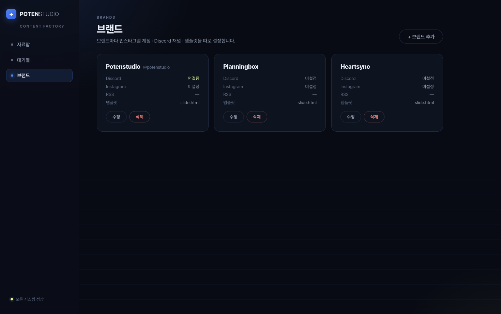
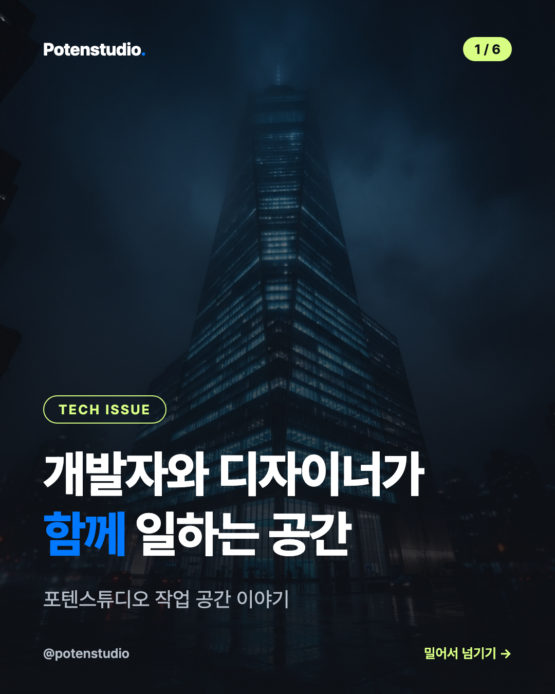
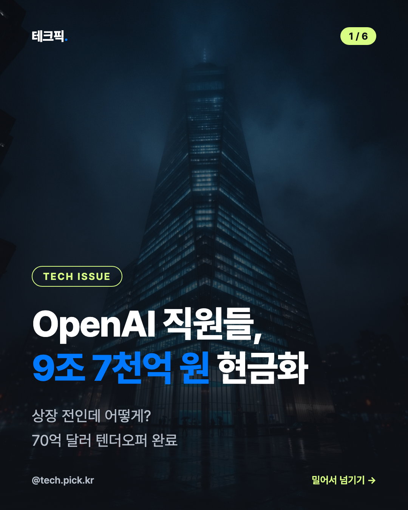
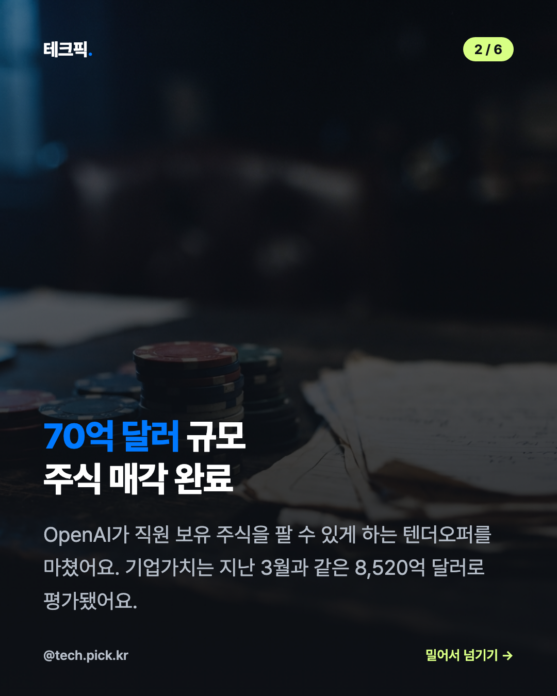

# 📰 POTENSTUDIO — Instagram Automation 구축 리포트

> **작성일** 2026-08-12 · **작성자** Raka · **상태** 로컬 가동 중 (내부 테스트)

---

## 1. 한 줄 요약

> 💡 **자료(사진·메모)만 넣어두면, 매일 아침 AI가 카드뉴스를 만들어 Discord로 승인을 요청하고, 승인하면 Instagram에 자동 게시되는 시스템이 완성됐습니다.**

---

## 2. 전체 흐름

```
자료함(웹 UI)  ──┐
                 ├──▶ 매일 아침 9시 자동 트리거
RSS 피드      ──┘
        │
        ▼
AI 카피라이팅 (Claude — 기사·자료 이미지를 직접 읽음)
        │
        ▼
배경 이미지 (업로드한 사진 우선, 부족하면 AI 생성 — Higgsfield)
        │
        ▼
카드뉴스 렌더링 (1080×1350 PNG, 브랜드 템플릿)
        │
        ▼
Discord 미리보기 + 버튼  ─── 🔄 디자인 재생성 (최대 3회)
        │ ✅ 승인
        ▼
Instagram 자동 게시 (Zernio)
```

- 팀이 하는 일은 **두 가지뿐**: ① 자료함에 재료 넣기 ② Discord에서 승인 버튼 누르기
- 주제를 비워두면 AI가 사진을 보고 스스로 주제를 정합니다
- 업로드한 사진은 AI가 내용 파악에 쓰고, 어울리는 슬라이드의 **배경으로도 직접 사용**합니다

---

## 3. 웹 UI (POTENSTUDIO)

potenlab.dev / POTENMANAGER와 같은 디자인 언어로 제작 (다크 네이비 + 블루프린트 그리드, Pretendard, 블루 #3B82F6 · 라임 포인트).

### 로그인


### 자료함 — 팀이 쓰는 유일한 입력 화면


- 브랜드 선택 → 주제(선택) → 사진 여러 장 (여러 번 나눠 추가 가능, 개별 삭제) → 메모 → 저장
- 저장된 자료는 매일 아침 브랜드당 1건씩 자동으로 소비됩니다

### 대기열 — 진행 상황 확인


- 상태: `자료함 → 대기중 → 생성중 → 미리보기 → 승인됨 → 게시됨` (+실패 시 재시도)
- 슬라이드 썸네일 미리보기, 10초 자동 갱신

### 브랜드 — 동적 브랜드 관리


- 브랜드 추가/수정: Instagram 계정, Discord 채널, RSS 피드, 템플릿, 카피 규칙을 브랜드별로 설정
- 현재 등록: **Potenstudio** (Discord 연결됨) · **Planningbox** · **Heartsync**

---

## 4. 결과물 샘플

| 자료 사진을 배경으로 쓴 커버 | RSS 기사 기반 커버 | 본문 슬라이드 |
|---|---|---|
|  |  |  |

- 왼쪽: 업로드한 스튜디오 사진이 그대로 커버 배경 — AI가 사진을 보고 `"개발자와 디자이너가 함께 일하는 공간"` 카피 작성
- 가운데: TechCrunch 기사를 AI가 읽고 원화 환산까지 해서 작성 (`9조 7천억 원 현금화`)

---

## 5. Discord 승인 흐름

- 생성 완료 → 브랜드별 채널에 슬라이드 전체 + 캡션 + 버튼 게시
- **✅ 승인** → Instagram 캐러셀로 자동 게시 (Zernio)
- **🔄 디자인 재생성** → 카피는 유지, 배경 이미지만 새로 생성 (최대 3회)
- 모든 봇 메시지는 한국어

---

## 6. 기술 구성

| 구성 요소 | 기술 |
|---|---|
| 웹 UI + API + 워커 | Node.js (Express) + SQLite, 포트 3002 |
| 카피라이팅 | Claude CLI (기사 WebFetch + 자료 이미지 Read) |
| 배경 생성 | Higgsfield CLI (nano_banana_2_lite, 4:5) |
| 렌더링 | Playwright — HTML 템플릿 → 1080×1350 PNG |
| 승인 | Discord Bot (`tech-pick cardnews`) |
| 게시 | Zernio API (Instagram 캐러셀) |
| 인증 | 공유 비밀번호 (팀 내부용) |

---

## 7. 남은 일 (다음 단계)

- [ ] **Cloudflare Tunnel** — 팀이 외부에서 웹 UI 접속 (준비됨, 미가동)
- [ ] **Zernio 연동 마무리** — API 키 발급 + Instagram 계정 연결 (코드는 완성)
- [ ] **jimin 템플릿** — Figma 최종본 나오면 HTML 템플릿으로 변환, 이후 템플릿 업로드 기능
- [ ] Planningbox · Heartsync — Discord 채널 + RSS 피드 설정
- [ ] (향후) 영상/쇼츠 자료 지원, Reels 출력

---

> 📌 문의: Raka · 시스템은 현재 로컬 Mac에서 가동 중이며, 매일 아침 9시에 자동 실행됩니다.
